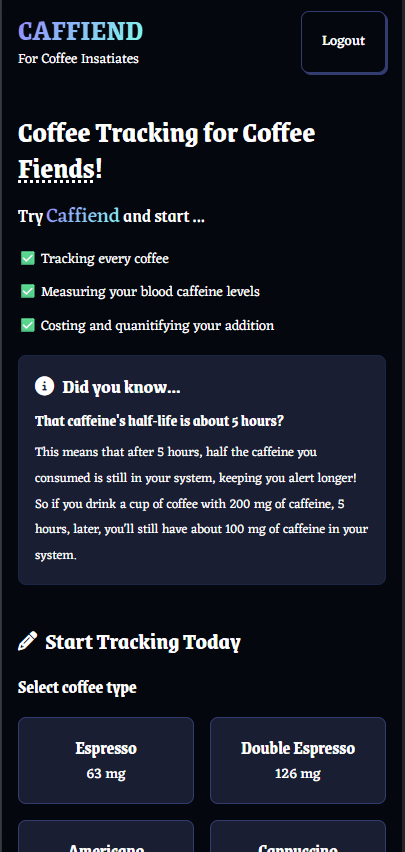
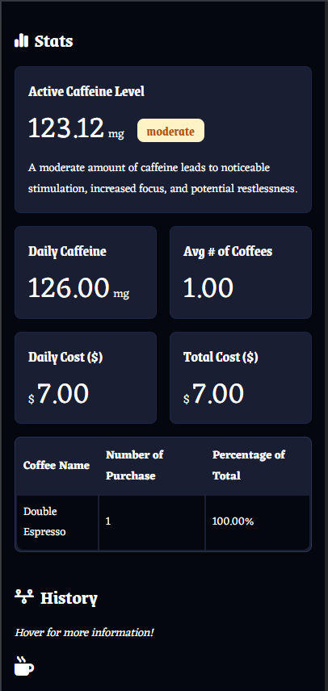

# ☕ Caffiend: Coffee Tracker App

A robust coffee consumption tracker built with React and Firebase, providing real-time caffeine level monitoring and personalized consumption statistics.

🌐 **Live Demo**: [Caffiend Web App](https://coffee-tracker-react.netlify.app/)

## 🚀 Features
- **Secure Authentication** via Firebase Auth
- **Real-time Coffee Tracking** with Firestore database
- **Active Caffeine Level** monitoring using half-life calculations
- **Personalised Statistics**: 
  - Daily caffeine intake
  - Average coffees per day
  - Consumption cost analysis
  - Top coffee types
- **Responsive Design** with FantaCSS styling
- **Interactive History** with detailed entry tooltips

## 🛠 Technologies
- React 18 + Vite
- Firebase Authentication
- Cloud Firestore (NoSQL database)
- React Context API
- FantaCSS
- Font Awesome

### Main Dashboard
  
*Landing view showing coffee selection, caffeine information, and tracking benefits*

### Statistics Dashboard
  
*Dashboard displaying active caffeine levels, consumption statistics, and history*


## ⚙️ Getting Started

### Prerequisites
- Node.js (>=16.x)
- Firebase project with:
  - Email/password authentication enabled
  - Firestore database
  - Security rules configured

### Installation
1. Clone the repository:
```bash
git clone https://github.com/hower-pazos/Coffee-Tracker.git
cd Coffee-Tracker
```

2. Create .env file with your Firebase config:
```bash
VITE_FIREBASE_API_KEY=your_api_key
VITE_FIREBASE_AUTH_DOMAIN=your_project.firebaseapp.com
VITE_FIREBASE_PROJECT_ID=your_project_id
VITE_FIREBASE_STORAGE_BUCKET=your_bucket
VITE_FIREBASE_MESSAGING_SENDER_ID=your_sender_id
VITE_FIREBASE_APP_ID=your_app_id
```
3. Install dependencies:
```bash
npm install
```
4. Start development server:
```bash
npm run dev
```

### 📂 Project Structure

```
src/
├── components/
│   ├── Authentication.jsx
│   ├── CoffeeForm.jsx
│   ├── Hero.jsx
│   ├── History.jsx
│   ├── Layout.jsx
│   ├── Modal.jsx
│   └── Stats.jsx
├── context/
│   └── AuthContext.jsx
├── utils/
│   └── index.js
├── firebase.js
├── App.jsx
└── main.jsx
```

